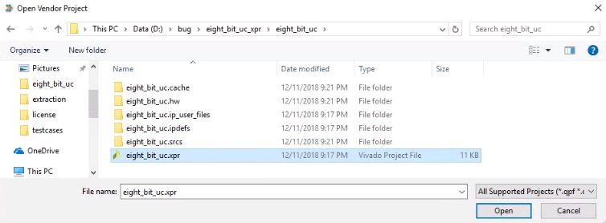
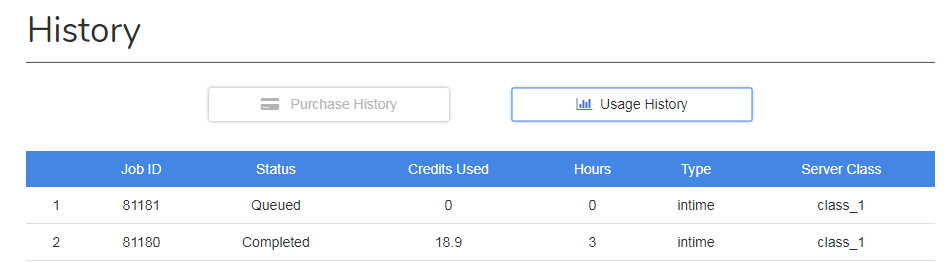

<h1>Tutorial: Optimize an FPGA Design using InTime on Plunify Cloud</h1>

(<a href="lang/中文/README.md">中文</a>|<a href="lang/日本語/README.md">日本語</a>)

## Introduction
This is a simple tutorial for the user to optimize an FPGA design with the InTime software, using the Plunify Cloud service. If you are new to InTime, please [apply for a free evaluation](https://www.plunify.com/en/free-evaluation/) of the software. 
This tutorial covers the "Hot Start" recipe, "InTime Default" recipe, and the "Extra Opt Exploration" recipe. The recipe flow and their configurations are shown as below.

**Recipe 1 : Hotstart**
  - runs per round  : 2
  - rounds          : 1
  - concurrent runs : 2
  
**Recipe 2 : InTime Default**
  - runs per round  : 2
  - rounds          : 1
  - concurrent runs : 2

**Recipe 3 : Extra Opt Exploration**
  - runs per round  : 2
  - rounds          : 1
  - concurrent runs : 2

## Requirements
1. InTime software version 2.6.8 or later ([Request a free evaluation](https://www.plunify.com/en/free-evaluation/))
2. Vivado software version 2017.2 or later
3. Plunify Cloud account ([Register](https://cloud.plunify.com/register) a new account or refer a friend to get free credits.)

## Steps

1. Download or clone the sample project.

`https://github.com/plunify/InTime-PlunifyCloud-Tutorial.git`

2. Start InTime and open the sample eight_bit_uc project.

3. Select the targeted toolchain. For this tutorial, we will use Vivado version 2017.2.

4. Change the 'Run Target' option to 'Plunify Cloud'.

5. Change 'Recipe' option to 'Hot Start' ('Hot Start' is the default recipe).

6. Configure the desired value for 'runs per round', 'rounds', 'concurrent runs' options as outlined in the Introduction section.

7. Click 'Start Recipe' to submit the job to Plunify Cloud.

8. Enter your Plunify Cloud credentials. Note: you only need to do this once.

9. Select the class of machine to use for cloud compilation. Use Class CA1 machines for this tutorial.

10. After choosing the machine class, InTime will generate a job ID for this submission and upload the project into Plunify Cloud for the actual compilations. Notifications will be shown to confirm if the job submission is successful or not. Make a note of the job ID (81181 in this example). You can use this job ID to track the job status on the [Plunify Cloud web console](https://cloud.plunify.com/).

11. (Optional) On the Plunify Cloud web console, check the job status under 'History'>'Usage History'

12. Upon completion, a notification message will be sent to your registered email address.

13. Back to the InTime software, right-click the 'impl 1' parent revision and select **Job Action>Download Remote Results>Download Remote Results Without Project File** to download the results.

14. Change the 'Recipe' option to 'InTime Default'.

15. Right-click the revision with the best TNS and 'Set As Parent Revision'. In this example, both revisions "hotstart_1" and "hotstart_2" have the same result so it is okay to pick either one.

16. Repeat Steps 7 to Step 14 to run the 'InTime Default' recipe. 

17. Change the 'Recipe' option to 'Extra Opt Exploration'.

18. Right-click the revision with the best TNS and 'Set As Parent Revision'. In this example, the revision with the best TNS is "calibrate_1". **Note** the calibrate_1 revision already met timing but we will continue using it to complete this tutorial. To enable this, set the 'Stop When Goal Met' option to 'False' in order to continue running. 

19. Repeat Steps 7 to Step 14 for 'Extra Opt Exploration' recipe run. 

20. Upon completion, the InTime results should look like those below.

