<h1>教程：使用 InTime 在 Plunify Cloud 优化 FPGA 设计</h1>

(<a href="../../README.md">English</a>|<a href="../日本語/README.md">日本語</a>)

## 教程介绍
本教程旨在指导用户通过 Plunify Cloud 的云服务器，来使用 InTime 软件优化 FPGA 设计。如果您首次使用 InTime，请免费[申请该软件的本地试用](https://www.plunify.com/cn/free-evaluation/)。 
本教程涵盖 "Hot Start" 配方、"InTime Default" 配方，以及 "Extra Opt Exploration"  配方。配方的流程以及它们的设置如下所示。

**配方 1 : Hotstart**
  - 每轮运行数: 2
  - 轮数      : 1
  - 并行运行数: 2
  
**配方 2 : InTime Default**
  - 每轮运行数: 2
  - 轮数      : 1
  - 并行运行数: 2

**配方 3 : Extra Opt Exploration**
  - 每轮运行数: 2
  - 轮数      : 1
  - 并行运行数: 2

## 工具要求
1. InTime 软件版本2.6.8或更新版本
2. Vivado 软件版本2017.2或更新版本
3. Plunify Cloud 账户 ([注册](https://cloud.plunify.com/register?lang=CN) 新账户以及邀请朋友都将获得免费云币)

## 步骤

1. 下载或克隆示例项目。

`https://github.com/plunify/InTime-PlunifyCloud-Tutorial.git`

2. 解压文件。 project/eight_bit_uc.xpr.zip

3. 启动 InTime，打开示例项目 eight_bit_uc。

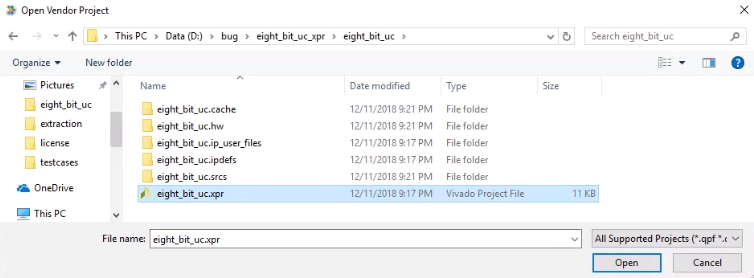

4. 选择目标工具。在本教程中，我们使用 Vivado 2017.2版本。

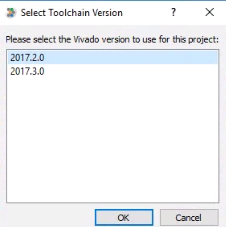

5. 把 'Run Target' 设置成 'Plunify Cloud'。

6. 把配方 ('Recipe')设置成 'Hot Start' ('Hot Start' 是默认配方)。

7. 将每轮运行数('runs per round')、轮数('rounds')、并行运行数('concurrent runs')设置成教程介绍中的数值。

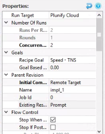

8. 点击 'Start Recipe'， 将任务提交到 Plunify Cloud 的云服务器。

9. 输入 Plunify Cloud 账户信息。您只需输入这一次。

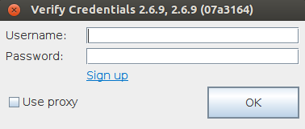

10. 选择云端编译的服务器类别。本教程中使用 Class CA1。

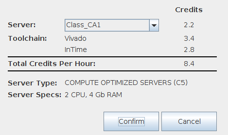

11. 选择服务器类别之后，InTime 会为本项目生成任务 ID (job ID)，并将项目上传到 Plunify Cloud 以进行编译。 上传成功或失败，都会有通知显示。请记住您的任务 ID(本示例中为81181)。您可以使用这个 ID 在 [Plunify Cloud 控制台](https://cloud.plunify.com/?lang=CN)查看任务进程。

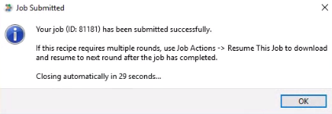

12. (选做) 在 Plunify Cloud 控制台，您可以在 'History'>'Usage History' 查看历史任务状态。

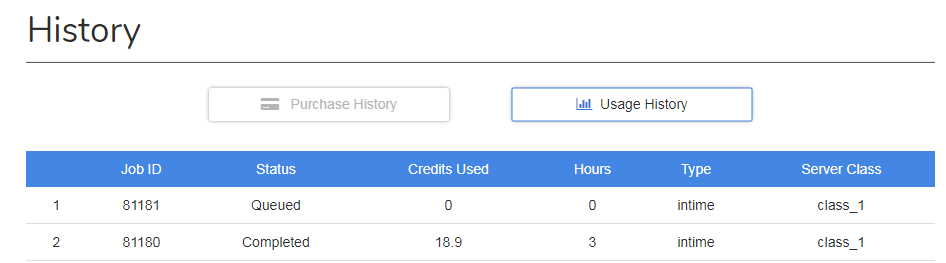

13. 完成之后，您的注册邮箱会收到一封通知邮件。

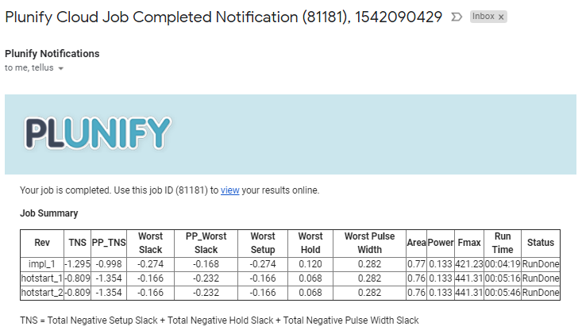

14. 回到 InTime 软件，右击'impl 1'的父版本，然后选择**Job Action>Download Remote Results>Download Remote Results Without Project File** 来下载结果。

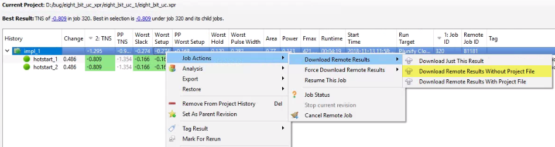

15. 将配方('Recipe')设置成 'InTime Default'。

16. 右击拥有最好 TNS 的版本，然后点击 'Set As Parent Revision' 将它设置成父版本。本示例中，"hotstart_1" 和 "hotstart_2" 拥有同样好的结果，所以在二者之间任选其一即可。

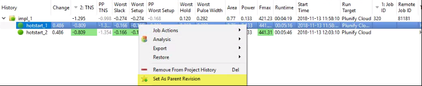

17. 重复步骤7到14，运行 'InTime Default' 配方。
18. 将配方('Recipe')设置成 'Extra Opt Exploration'。

19. 右击拥有最好 TNS 的版本，然后点击 'Set As Parent Revision' 将它设置成父版本。本示例中，"calibrate_1" 拥有最好的 TNS。 **注意** "calibrate_1" 版本已经达到时序要求，但是我们仍然使用它来完成这个教程。您可以在时序目标实现的时候停止运行，您只需将 'Stop When Goal Met' 设置成 'False' 即可。

20. 重复步骤7到14，运行 'Extra Opt Exploration' 配方。

21. 完成之后，InTime 结果应该如下图所示。

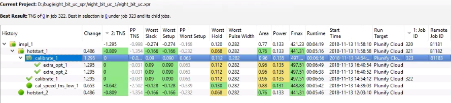

