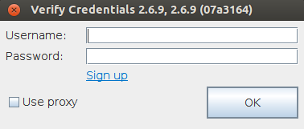
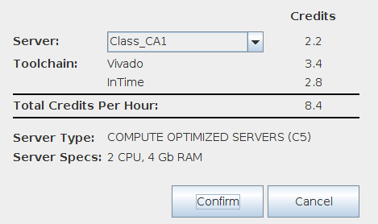
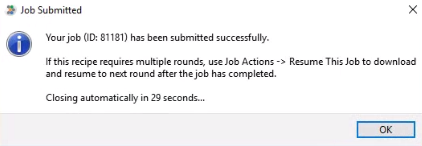
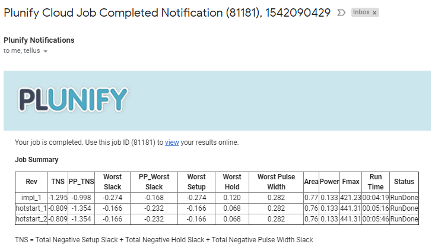
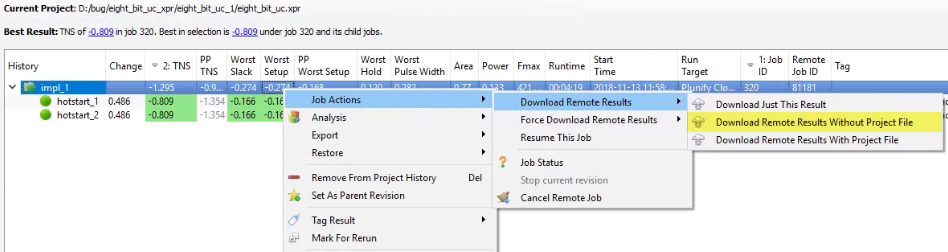

<h1>チュートリアル：Plunify CloudでInTimeを使用したFPGAデザインの最適化</h1>

(<a href="../../README.md">English</a>)

## イントロダクション
これは、Plunify Cloud サービスを使用して、InTimeソフトウェアでFPGAデザインを最適化するための簡単なチュートリアルです。このチュートリアルでは、 "Hotstart" Recipe、 "InTime Default" Recipe、 "Extra Opt Exploration" Recipeについて説明します。Recipeのフローとその構成を以下に示します。

**Recipe 1 : Hotstart**
  - runs per round  : 2
  - rounds          : 1
  - concurrent runs : 2
  
**Recipe 2 : InTime Default**
  - runs per round  : 2
  - rounds          : 1
  - concurrent runs : 2

**Recipe 3 : Extra Opt Exploration**
  - runs per round  : 2
  - rounds          : 1
  - concurrent runs : 2

## 要件
1. InTimeソフトウェアバージョン2.6.8以降
2. Vivadoソフトウェアバージョン2017.2以降
3. Plunify Cloud アカウント (新規アカウント[登録](https://cloud.plunify.com/register)  または友人に紹介して無料クレジットを獲得)

## ステップ

1. サンプルプロジェクトのダウンロードまたはクローンを作成します。

`https://github.com/plunify/InTime-PlunifyCloud-Tutorial.git`

2. project / eight_bit_uc.xpr.zipファイルを解凍します。

3. InTimeを起動して、サンプルプロジェクト eight_bit_uc を開きます。

4. ターゲットツールチェインを選択します。このチュートリアルでは、Vivadoバージョン2017.2を使用します。

5. 'Run Target'オプションを 'Plunify Cloud'に変更します。

6. 'Recipe'オプションを 'Hot Start'に変更します（'Hot Start'がデフォルトのレシピです）。

7. イントロダクションのセクションで説明したように、'runs per round'、'rounds'、'concurrent runs' オプションを希望の値に設定します。

8. 'Start Recipe'をクリックして、ジョブをPlunify Cloudに送信します。

9. Plunify Cloudの資格情報を入力します。注：これは一度だけ入力する必要があります。

10. クラウドでのコンパイルに使用するマシンのクラスを選択します。このチュートリアルでは、Class 1マシンを使用してください。

11. マシンクラスを選択すると、InTimeはこのサブミッションのジョブIDを生成し、実際のコンパイル用にプロジェクトをPlunify Cloudにアップロードします。ジョブの提出が成功したかどうかを確認する通知が表示されます。ジョブIDを書き留めます（この例では81181）。このジョブIDを使用して、[Plunify Cloud website](https://cloud.plunify.com/) のジョブステータスで追跡ができます。

12. (オプション）Plunify CloudのWebサイトで、'History'>'Usage History' からジョブのステータスを確認できます。

13. 完了すると、登録されたメールアドレスに通知メッセージが送信されます。

14. InTimeソフトウェアに戻って、'impl 1'の parent revisionを右クリックして、**Job Action>Download Remote Results>Download Remote Results Without Project File** を選択して結果をダウンロードします。

15. 'Recipe' オプションで 'InTime Default'に変更します。.

16. ベスト結果の TNS を右クリックして'Set As Parent Revision'を選択します。この例では、"hotstart_1" と "hotstart_2" は同じ結果のため、どちらを選択しても問題ありません。

17. 手順7〜手順14を繰り返して、「InTime Default」Recipeを実行します。

18. 'Recipe'オプションを 'Extra Opt Exploration'に変更します。

19. ベスト結果の TNS を右クリックして 'Set As Parent Revision'を選択します。この例では、ベスト結果の TNS リビジョンは「calibrate_1」です。**注** calibrate_1 リビジョンは、すでにタイミングメットしていますが、このチュートリアルを完了するためにあえてこれを使用して実行します。これを有効にするには、'Stop When Goal Met' オプションを 'False' に設定して継続します。 

20. 'Extra Opt Exploration'Recipe を実行するには、手順7〜手順14を繰り返します。

21. 完了すると、InTimeの結果は以下のようになります。

